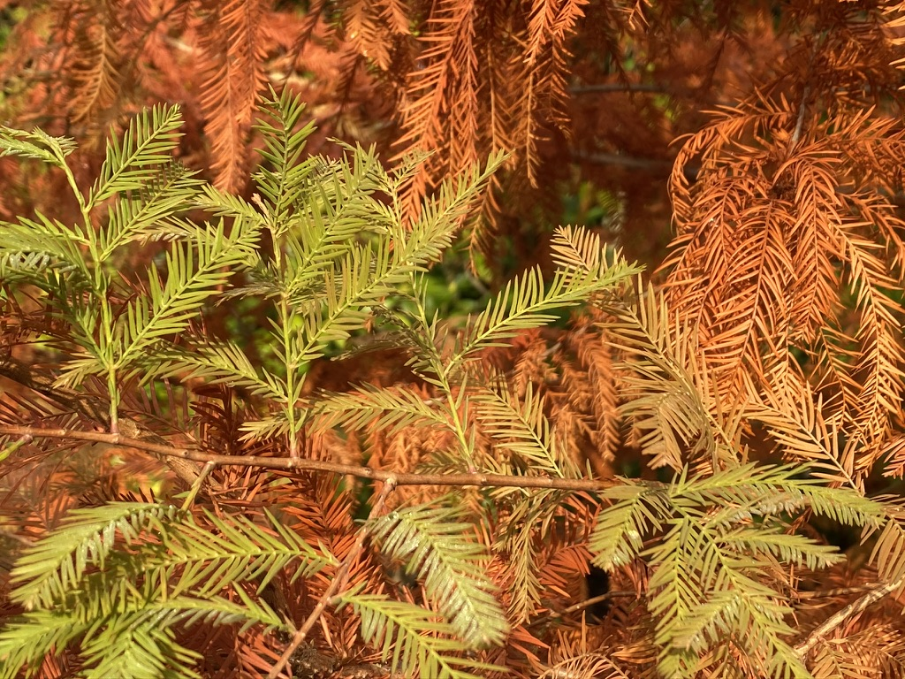

## Time for a change
The site nicklewis.net has gone through various stop-starts over the years and in fact you can find the original Wordpress powered site at [nicklewis.online](https://nicklewis.online) where there are some 800 posts but I was never entirely happy with them or at least a good percentage of them. I have wished to write about many things and being prone to procrastination, I fell down the rabbit hole of blogging where you just lose direction completely and reach a point where you want to give it up.

Not being one to give in too easily I came to the conclusion that all blogs should have a name that depicts their content and I can name a few sites that have inspired me, where the authors share a common range of interests to my own. 

Since I clearly love photography and exploring places on foot, I decided that I must knuckle down to concentrating on writing just about these two topics but how best to go about it? Simple, I came up with the name "The Rambling Photographer" and was telling my wife about this the other day with which she responded, "Now I like that, good name, you enjoy rambling both in the way you walk and talk!". We laughed at that but she genuinely liked the new title.

So today I have launched a second website and would like to tell you about what I have up my sleeve, for the year ahead.

## Location guides
The new site will focus on providing it's audience with town, city, village and rural guides complete with photos, maps and wot-not. I am also going to host photowalks and workshops etc... Those items will of course take time to develop so in the meantime, business as usual, the blog will continue pretty much as it has over the past month and a half ([Write52](https://write52.com) contributors will know) with my photographic essays on the places I love, in the hope that others will also visit them someday!

## Sources of inspiration
In terms of blogging, I have been inspired by so many but below are two of my current favourites. 

[The lost Byway by John Rogers](http://thelostbyway.com/) - John also runs a very entertaining YouTube channel where he takes you on tours of parts of London, you'd never knew even existed. I highly recommend his book, "This Other London" which I am reading at the moment.

[Documentally](http://documentally.com/) - Not so much an author of walking books, although Christian does write about the outdoors quite a bit, his podcasts over the years have always been engaging. He now teaches others how to create their own documentaries.

I will mention more people in future posts and would be lovely to meet with some of you, maybe come along on a walk with me and we can chat about everything under the sun. Told you I like to ramble in more ways than just the one!

I can't complete a post without at least some photographs...

## Early morning Wisley
My cover photo for this article was taken in the Aboretum at [RHS Wisley](https://www.rhs.org.uk/gardens/wisley) which opens at about 9am on Sundays. I highly recommend arriving there at about that time because it does get very busy around 10am and onwards. It is rather fantastic having it almost to yourselves, especially on a bitterly cold, frosty yet rather magical morning, as we did the other day. The light was quite special, as it only can be at this time of year in England. 

Here are some photos, as you have come to expect from me by now! I am going to add a new style of gallery soon to these pages to present photos in more of a "Pinterest" style grid but just haven't got around to it yet. 

I love this one especially with the Cyclamen flowers in the foreground 

## Until next time...
I am heading out to a few places over the coming weeks, so that means the hungry content monster that this blog is, will be well fed! Expect a mixture of Surrey Hills and Christmas Markets!

