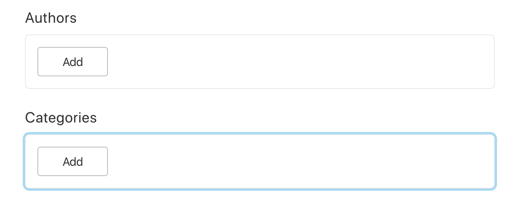

I tend not to work with traditional CMS systems anymore but with modern BaaS (back-end as a service) cloud services which I find are more lightweight, easier to get up and running plus scalable in size and price to suit all budgets. I am constantly reviewing all of the options on the market but the most compelling at the moment is Sanity, a Headless CMS product that is taking the industry by storm. So far I have found Sanity to be easy to use and is the best by far for mobile responsiveness, it just looks really sweet on my iPhone or iPad. Here is a little screen shot of the back-end behind this website:

Here is how it looks on your mobile and in terms of use, it has a very nice UX (User Experience) which you would love. 

I am able to develop the data models any site uses to capture data via this back-end and then render to the actual website itself. This blog post for example is built up out of a series of items which can be called components, blocks or whatever it is you want to call them. In the case of this post, the data model looks something like:

- Title
- Summary
- Published Date
- Updated Date
- Created Date
- Cover Image
- Section
- Category
- Tags
- Body of article which can contain images, embedded video and of course text of various styled formats

If I wanted to, this could be more complex. Let's imagine for a moment that you wanted to create a section of cookery recipes and the data model for these could be the same as above but with added:

- Ingredient 1
- Ingredient 2
- Etc, etc
- Step 1
- Step 2
- and so on...

Structured CMS data can help provide the back-end for the above kind of items, as you can never be too sure how many ingredients there may be? You want to allow the user to add whatever they need to and the same goes for the steps. You can with our system add items "dynamically", that is to say, you can add as many as you wish of each type of item. This data being structured makes it a lot easier to render out the pages later on that present the recipe to the general public when they hit your site, looking for a particular dish.

In the case of this website I am able to add dynamic categories:

Which brings up a drop down list of categories I can pick from:

I select an item from this either by clicking on the drop-down or typing in the code because I know what it is anyway:

This then inserts the chosen item into the form:

You will notice the "handle" icons on the left of each item above, these allow me to manually rearrange the items in the list which can be very useful for ensuring that the page this renders to is in the order you want it to be, dependent on the content it contains of course.

To be honest this is merely a short introduction to what this thing is capable if doing, Sanity has a lot of power and I am able to effect the code that runs the above dashboard I've illustrated in this post. It's totally flexible meaning that I can build unique experiences for my clients who depend heavily on content delivery to their own clients.

## Who are Sanity.io?
[Sanity](https://sanity.io) are a very progressive Norwegian company based in Tromso and San Francisco who are disrupting the way in which we think about the tried and tested CMS system. I am currently adopting their product into my own workflow and have been trying it out for the running of part of this website.