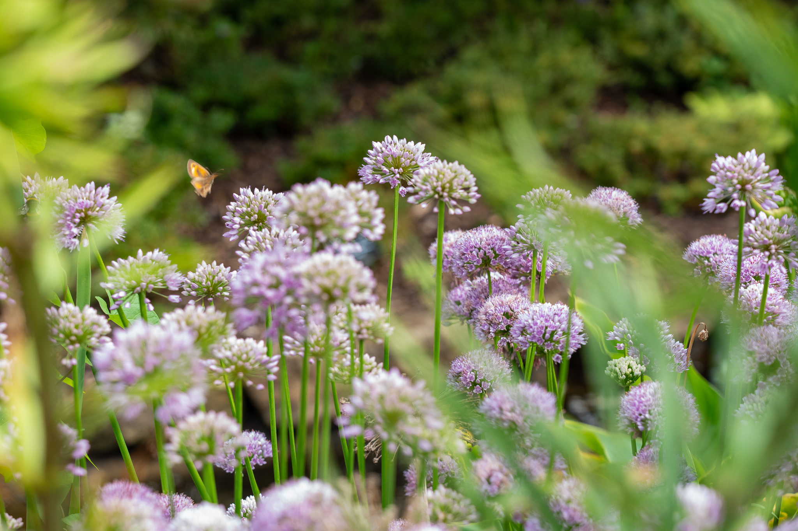
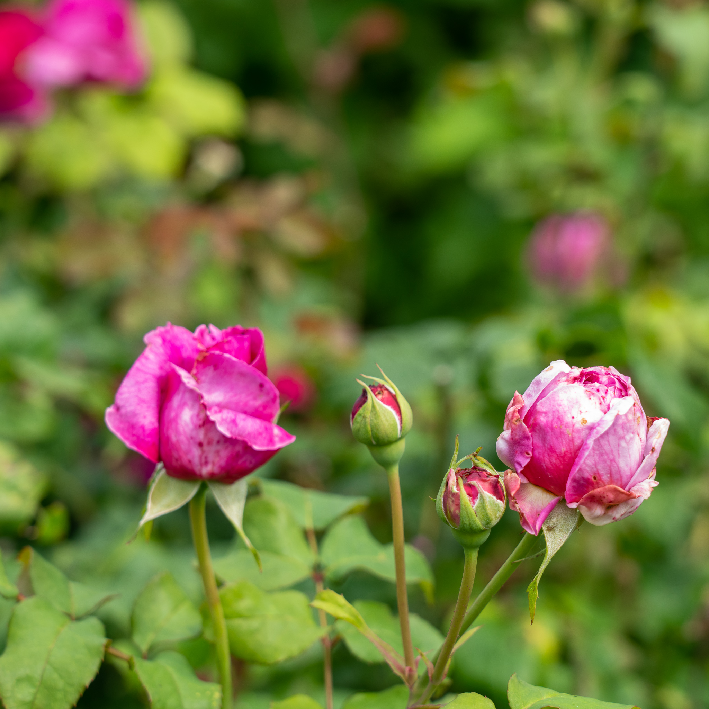
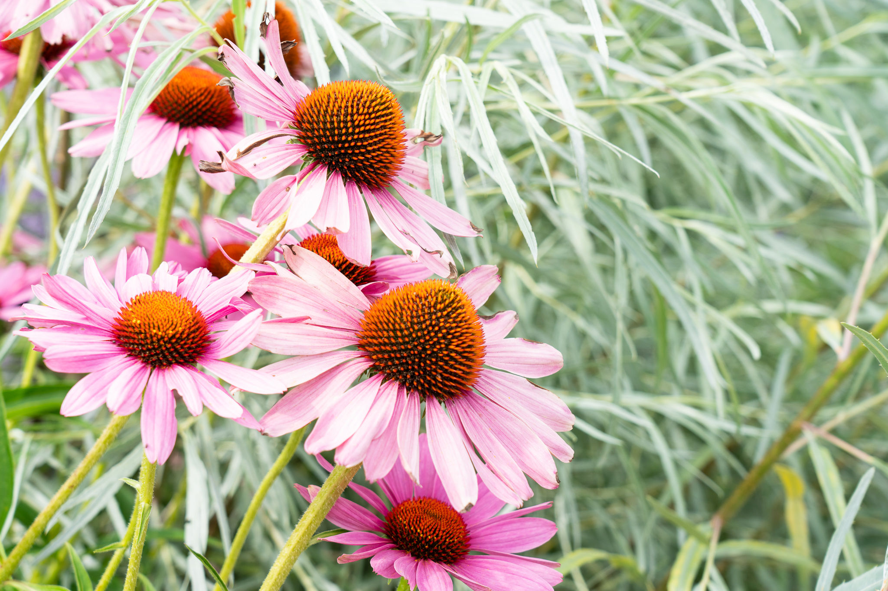
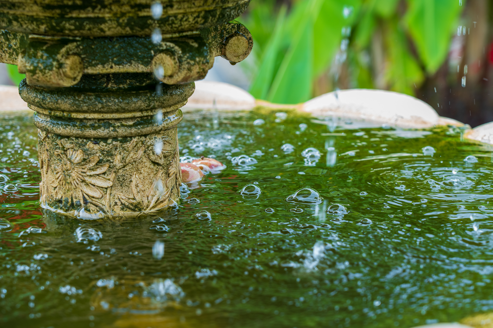

We have been members of the RHS for a long time and Wisley is a place we go to a dozen times every year because it is a brilliant location to get some fresh air and there are always subjects there to photograph.

## We were very impressed 
It was also the first time we had been since the new reception building opened about a month or so back. It really is quite something. I like the way the garden centre, shop and cafe have been rolled into one huge mall plus it is very light and airy with places to sit in the shop if you want to take a slower look at a book you are planning to buy. The bookshop is huge and the plant selection colossal.

We are thinking of planting some lower level plants to sit beneath the larger shrubs and roses in our own garden. So these lovely Alliums caught our eyes because of the frenzy of insect activity that they were attracting. The shot below illustrates this, I wanted the depth of field to be shallow, so it works quite well as a photograph with the layers of pin sharp and out of focus elements, if only that small butterfly was a bit more distinct, for me that lets the shot down a bit.

Wisley's Rose garden was looking particularly resplendent today, though the light was too harsh for my liking, I found it a bit of a challenge at times with some parts of the gardens being covered by cloud offering the occasional respite.

Turning the corner revealed these glorious Echinacea flowers at their colourful best this Summer. I loved the soft pastel shades that the plant combinations provided here. Very subtle but just enough separation in the pallette.

## Just love those Echinacea

## Pollinating Butterflies
Then I spotted the butterfly and took a burst of shots as the insect probed the flower head for pollen. My 24-105mm lens works pretty well for "macro" but I am on the lookout for a dedicated macro, around the 90mm f2.8 area would be nice as that would really open up a whole new level of photography with subjects like this. I am eager to explore this avenue more deeply as someone who is seeking to develop some key areas in their work.

## Entering the Tropics
We ventured on and found ourselves in the Exotic garden which was opened last year. It is there all year round but in the winter many of the plants are wrapped in fleece to protect them from the frosts, winds and generally nasty weather, some they may even more indoors somewhere I'd suspect.

Thankfully that was not the case today, as we felt as if we had taken a flight down to the Equator or had gone back to the shores of Madeira once more (note to self to publish articles on that subject soon)

More Echinacea, clearly I've become obsessed by them!

This one I am going to do a big print of soon...

I like to crop in and get some details, as I could have quite easily have just photographed the whole fountain but Wisley was busy today with a lot of people around and that was no surprise given how glorious the morning was today! The bubbles certainly added a bit of "animation" to the still image. I have no idea why there were apples in the water, as there were no overhanging fruit trees.

# A frame within a frame
Sometimes you take a larger shot and then realise the best picture is within the main image, I am sure you've experienced this before. One of the advantages of having such a high resolution sensor in the A7R3, is that with 42mp, cropping is never a problem, as you will always be very happy with the sharpness and clarity of what you end up with, plus the dynamic range in these cameras is nothing short of insane! So much data to play with that the post production options are great, not to mention how good these images look when you print them big.

## High Five!
I've got a few "fives" today. Fives are my keepers, my images that make me a happy chappy!

I have devised my own rating system within Lightroom that I shall explain a little bit here and perhaps you have something similar. My five rated images are the ones I print and offer customers as products, the ones I am really chuffed with. Going down the scale, I assign those I'm not sure about as 3 but quite often look at a few months later and really love. I occasionally upgrade them to fives!

What about 4,2 and 1? I use 4 for those that I do really like but not sure are fit for my portfolio, then 1s and 2s, what's the point, they might as well be deleted!

How do you rate your images? How do you cull? Do you keep everything or are you ruthless? Please post your answers in the comments below or a postcard if you prefer!