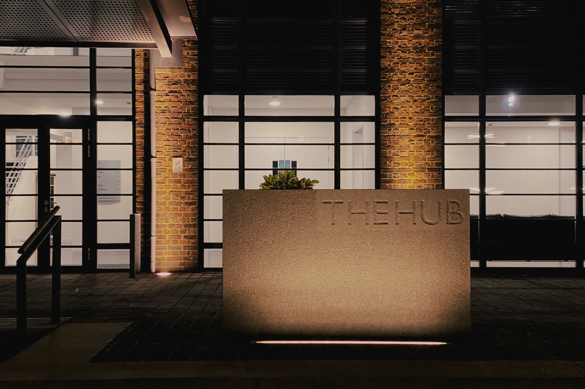

## iPhone 11 

You may recall in my last post I mentioned that I'd ordered my new iPhone 11 Pro Max from Vodafone as an upgrade. I had a few problems with the order and Vodafone let me down a bit initially but after I made a complaint about their disjointed service, I didn't need to wait for 3 weeks for delivery, it came through in four days! Shame I had to kick up a fuss.

Grumbles to one side, let's take a look at what this device can do. This isn't a review, I don't tend to write reviews but if it ends up sounding like a review, it wasn't intended to be! I am also mainly reviewing (sorry, not reviewing) the iPhone 11 Pro Max as a camera. I shall talk more tech in future posts, as I plan to do that anyway as I sharpen my blogging repertoire.

So far I've tested it in two very different scenarios: Night time around Farnborough and in the wilderness of the Brecon Beacons, Wales! In both cases I was faced with tricky lighting conditions which challenged me a bit but the iPhone seemed to cope incredibly well, a far cry from what phone based cameras used to be like in the early 2000's.

## Farnborough Business Park - night mode
- the following images demonstrate night photography shot around Farnborough and to summarise, I am bowled over by it’s capabilities, this is a revolutionary jump forward. Kind o like comparing one of those little cardboard cameras you used to get at weddings to a Leica!

*Samuel Cody was an American Aviaton pioneer who had settled in England and made the first powered flight in history. His statue is located next to the FAST Museum.*

The Business Park next to Farnborough's Airport was borne out of what used to be the old RAE site and now sports a spectacular mix of modern offices, a hotel and lovingly restored heritage buildings. One of these structures is the Balloon Hangar that was fairly recently reinstated by a group of people who discovered it's parts stowed away in a building on the old site. They decided to resconstruct it and it has formed a fantastic centre-piece for the business park. The former terminal building complete with it's control tower has been re-purposed as smart modern offices. The old wind tunnels are well maintained and at certain times of the year you can take tours inside them, something I've not yet done and have been itching to do for years.

I am drawn to brutalist architecture and at night time it takes on a very different look and feel especially in a well lit car park like this one. Many years ago I took part in a photographic challenge where you had to find numerals in urban scenes. This reminds me of that!

## ultra-wide angle

I love the ultra-wide angle lens that comes as one of the trio of lenses with the Max Pro, as it opens up a whole host of new opportunities and by jove it is very wide indeed. I like using it for perspectives where you wouldn't instantly reach for a 14mm focal length under normal circumstances like these shots here.

## video

I haven’t yet had the chance to talk about it’s video capabilities but they are also way better than ever before. I like the way you can just press and hold the shutter button and it instantly switches to video mode and begins recording until you release the button. That is a really nice touch. Check out my Instagram feed (links in footer) to see videos I’ve captured recently, most are quite raw and without any post production at the moment.

## The mighty Brecon Beacons

Last Saturday and Sunday we drove up to Wales from our Hampshire base and spent the night there before travelling back the following day. We were doing a recce for a bigger trip that takes place next year, looking for locations. THe weather on the way up was horrendous and it didn’t improve much on the Saturday. However some dry spells ensued and Sunday morning was quite glorious and the temperatures climbed back up.

You could tell that Wales, much like most of the UK has seen a lot of rain in recent weeks and the West coast took a serious pelting this weekend. Talking to local people, they all had experienced being cut off at times with power cuts at times.

The Pentwyn Reservoir was rather high indeed and we were all fascinated by the **Bellmouth Spillway** seen here in the photo above, it was roaring like a giant monster sucking the water out! It was quite a frightening looking thing and reminded me of the scary moments faced by residents of the town of Whaley bridge in Derbyshire earlier this year. 

We came across the Brecon Mountain Railway in a few different spots during our recce. Looks like a lot of fun, added to the list for a warmer time of year as a potential trip to take.

The final photo here was taken along what I think was the Four Falls trail and near a waterfall that I did capture images of but none of which I was happy with. Just goes to show how some subjects can be difficult to photograph. I will be revisiting so will go equipped with the big camera, tripod, filters and also the drone for some epic footage. All of which is on the cards for 2020. Yes, that is looming ever closer.